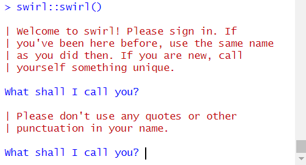
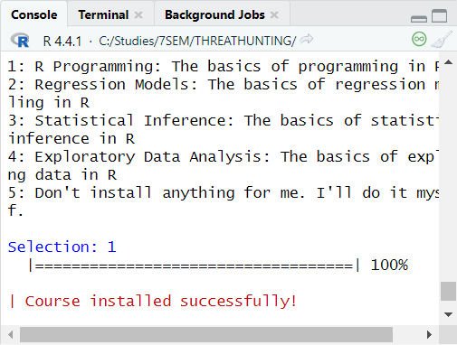

# Лабораторная работа №1

## Выполнено Зайцевым Ильёй Владимировичем

## mragentseven@yandex.ru

## Цель работы 

Развить практические навыки использования современного стека воспроизводимых исследований

## Исходные данные

1. Программное обеспечение Windows 10 Pro
2. Rstudio Desktop
3. Интерпретатор языка R 4.4.1

## Задание

1. Подготовить рабочее окружение для работы с Rstudio
2. Разработать отчет с использованием стека технологий Rmarkdown и Quarto
3. Оформить отчет в соответствии с шаблоном

## Шаги

1. Устанавливаем на наше устройство R и Rstudio.

2. Устанавливаем Git для синхронизации с Github

## Вывод

Мы научились создавать и делать отчет в RStudio, а также загружать работы на GitHub.
