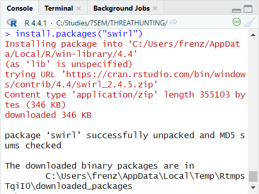
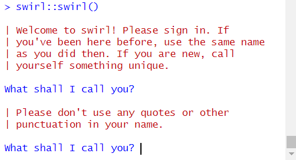
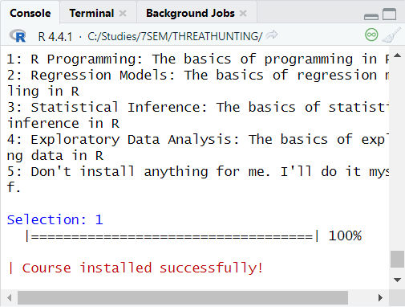

# Введение в R
Выполнено Зайцевым Ильей Владимировичем, mragentseven@yandex.ru

# Лабораторная работа №2

## Цель работы

1.  Развить практические навыки использования языка программирования R
    для обработки данных
2.  Развить навыки работы в Rstudio IDE: установка пакетов работа с
    проектами в Rstudio настройка и работа с Git
3.  Закрепить знания базовых типов данных языка R и простейших операций
    с ними

## Шаги

1.  Устанавливаем swirl

    

2.  Запускаем задание с помощью swirl::swirl()

    

3.  Выбираем первый пункт

    

4.  
