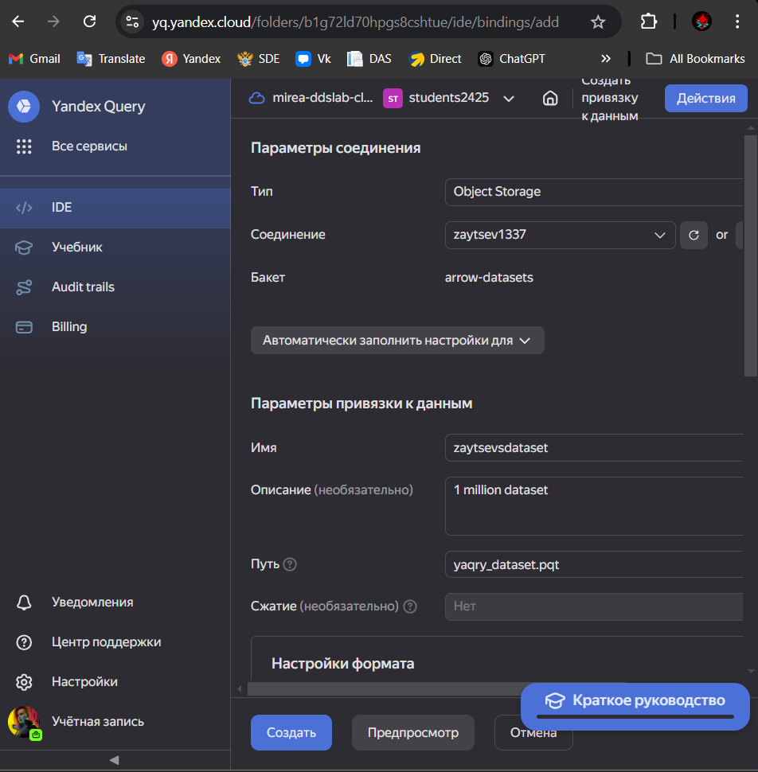
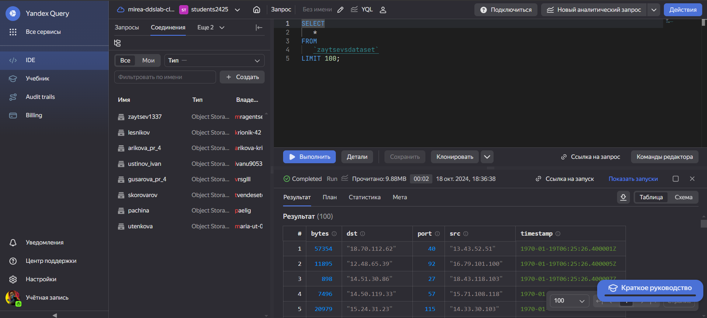

# Лабораторная работа №4. Использование технологии Yandex Query для анализа данных сетевой активности

## Выполнил Зайцев Илья Владимирович, mragentseven@yandex.ru

## Цель работы

1.  Изучить возможности технологии Yandex Query для анализа
    структурированных наборов данных
2.  Получить навыки построения аналитического пайплайна для анализа
    данных с помощью сервисов Yandex Cloud
3.  Закрепить практические навыки использования SQL для анализа данных
    сетевой активности в сегментированной корпоративной сети

## Исходные данные

1.  ОС Windows 11 Pro
2.  Rstudio Desktop
3.  Интерпретатор языка R 4.4.1
4.  Yandex Query
5.  Бакет arrow-datasets

## Ход работы

Проверить доступность данных в Yandex Object Storage

Проверьте доступность данных (файл yaqry_dataset.pqt) в бакете
arrow-datasets S3 хранилища Yandex Object Storage. О принципах
построения пути можно посмотреть здесь. Проверить можно просто перейдя
по правильно сконструированному URL в браузере.

Создать соединение для бакета в S3 хранилище Заполняем поля с учетом
допустимых символов, выбираем тип аутентификации (все же помнят что это
такое!) – публичный. Вводим имя бакета в соответствующее поле и
сохраняем.

Теперь, после создания соединения, укажем какой объект использовать в
качестве источника данных. Для этого нужно сделать привязку данных.

# Задания

Известно, что IP адреса внутренней сети начинаются с октетов,
принадлежащих интервалу \[12-14\]. Определите количество хостов
внутренней сети, представленных в датасете.

Определите суммарный объем исходящего трафика

Определите суммарный объем входящего трафика

# Оценка результата

В результате лабораторной работы было определено количество хостов
внутренней сети, суммарный объём исходящего трафика и суммарный объём
входящего трафика

# Вывод

Были изучены возможности технологии Yandex Query для анализа
структурированных наборов данных, получены навыки построения
аналитического пайплайна для анализа данных с помощью сервисов Yandex
Cloud и закреплены практические навыки использования SQL для анализа
данных сетевой активности в сегментированной корпоративной сети
