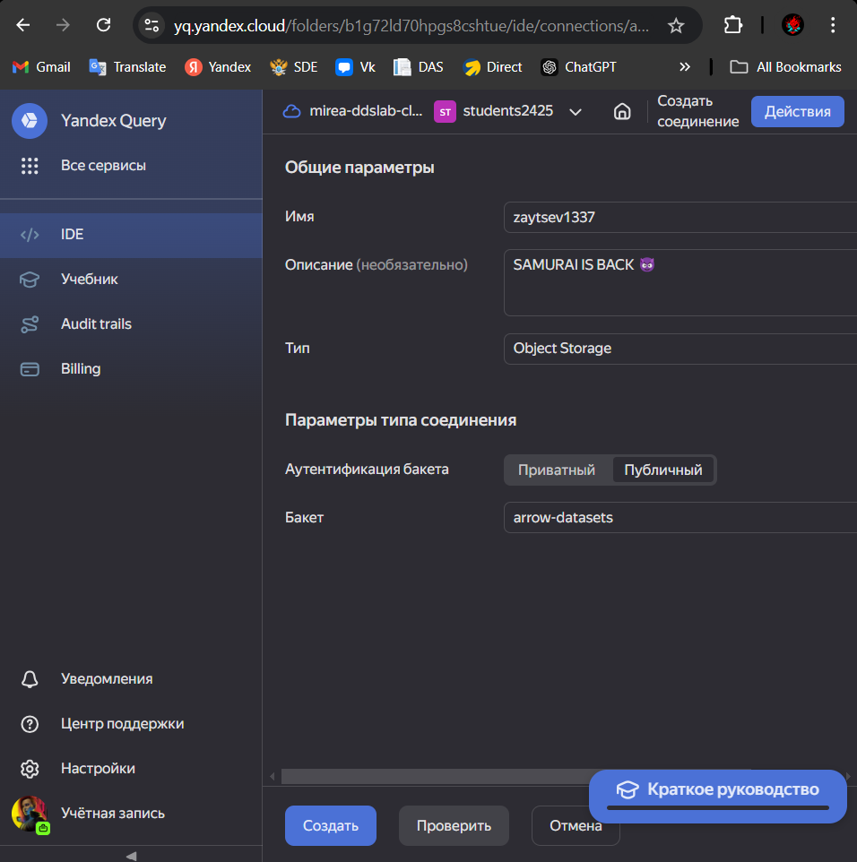
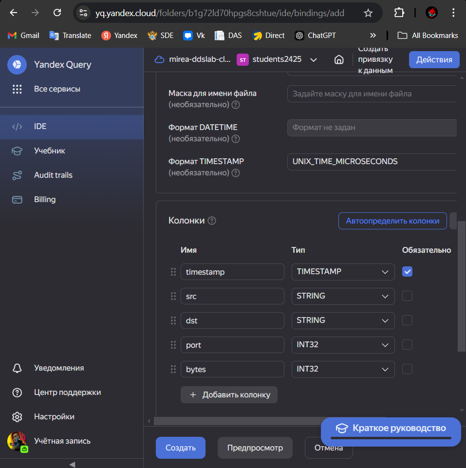

# Использование технологии Yandex Query для анализа данных сетевой
активности
Выполнено Зайцевым Ильей Владимировичем, mragentseven@yandex.ru

# Лабораторная работа №4

## Цель работы

1.  Изучить возможности технологии Yandex Query для анализа
    структурированных наборов данных
2.  Получить навыки построения аналитического пайплайна для анализа
    данных с помощью сервисов Yandex Cloud
3.  Закрепить практические навыки использования SQL для анализа данных
    сетевой активности в сегментированной корпоративной сети

## Ход выполнения работы

1.  Проверить доступность данных в Yandex Object Storage

Проверьте доступность данных (файл yaqry_dataset.pqt) в бакете
arrow-datasets S3 хранилища Yandex Object Storage. О принципах
построения пути можно посмотреть здесь. Проверить можно просто перейдя
по правильно сконструированному URL в браузере.

Yandex Query – это облачное решение для анализа данных, в котором задачи
организации хранения, обеспечения доступа и выполнения первичного
анализа данных полностью берет на себя сервис-провайдер, то есть Yandex
Cloud. Теоретически, весь анализ данных мы можем провестти с любого
устройства, хоть со смартфона! О Yandex Query можно посмотреть
замечательный вебинар от его разработчиков. Перед проведением анализа
нам надо связать Yandex Query с хранилищем наших данных. В нашем случае
это S3 Object Storage от Yandex Cloud.

1.  Создать соединение для бакета в S3 хранилище
2.  Заполняем поля с учетом допустимых символов, выбираем тип
    аутентификации (все же помнят что это такое!) – публичный. Вводим
    имя бакета в соответствующее поле и сохраняем.

1.  Теперь, после создания соединения, укажем какой объект использовать
    в качестве источника данных. Для этого нужно сделать привязку
    данных.

# Анализ

Решите следующие задания: 1. Известно, что IP адреса внутренней сети
начинаются с октетов, принадлежащих интервалу \[12-14\]. Определите
количество хостов внутренней сети, представленных в датасете.

1.  Определите суммарный объем исходящего трафика

1.  Определите суммарный объем входящего трафика

# Оценка результата

В результате выполненной работы было установлено собственное соединение
с датасетом и выполнены все задания

# Вывод

После выполенной работы были улучшены навыки написания SQL-запросов, а
также был проанализирован датасет исходящего и входящего трафиков)
