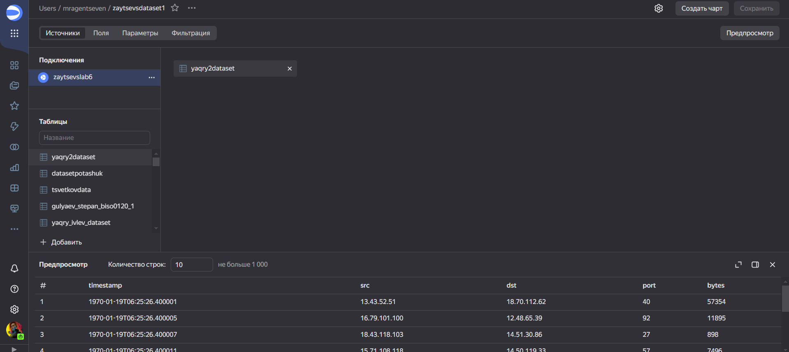
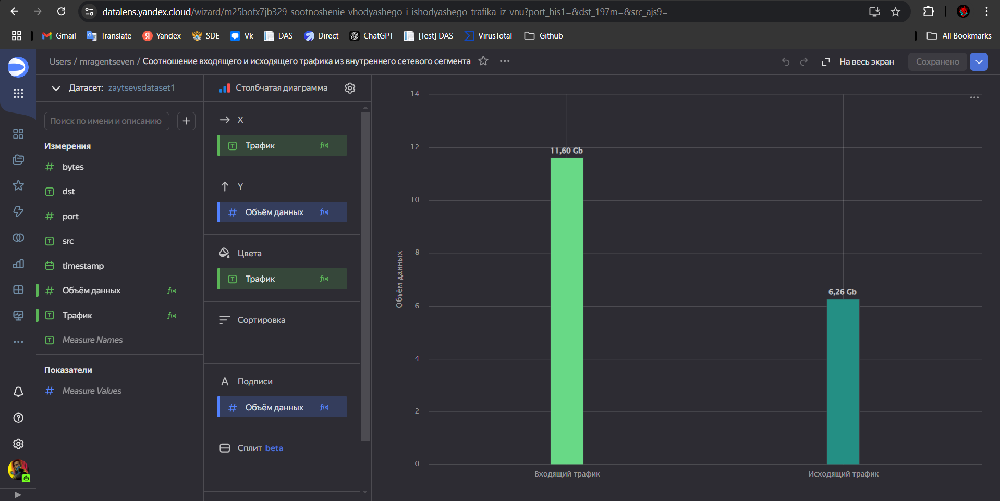
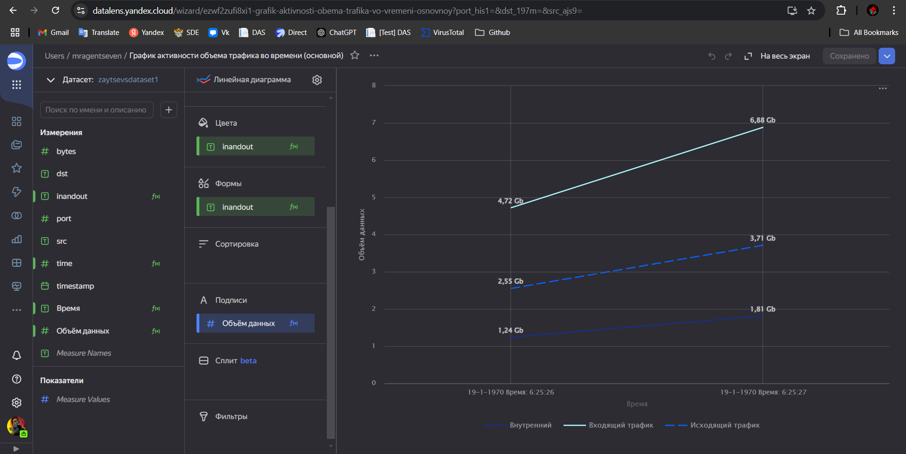
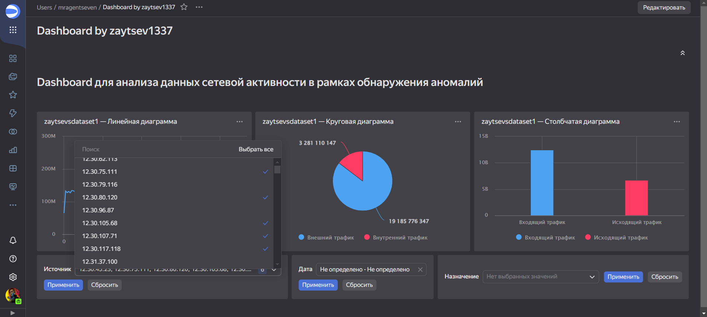
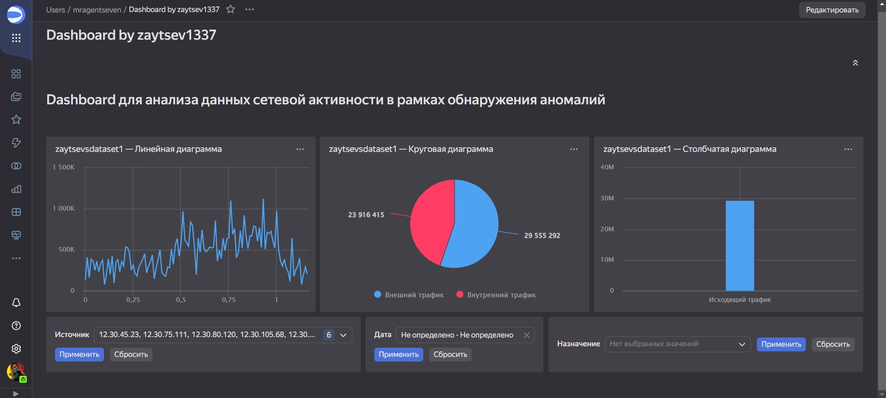
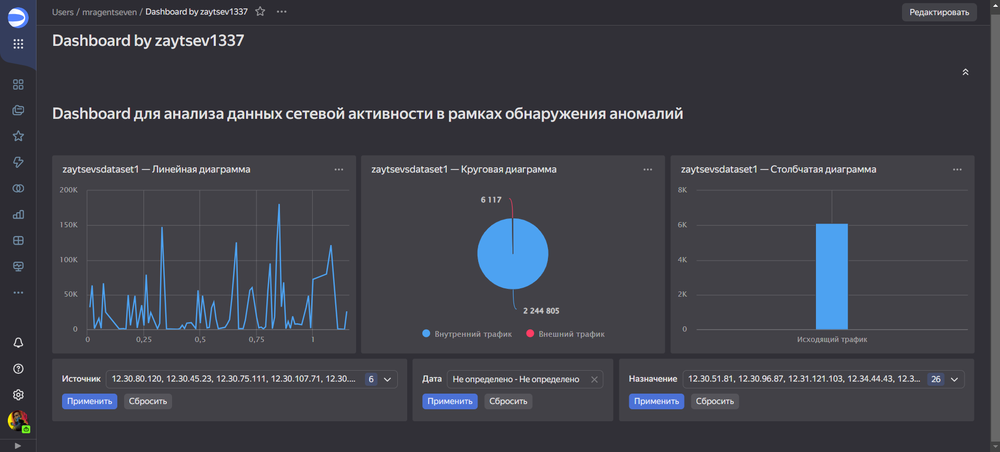

# Использование технологии Yandex DataLens для анализа данных сетевой
активности
mragentseven@yandex.ru

# Лабораторная работа №6

## Цель работы

1.  Изучить возможности технологии Yandex Query для визуального анализа
    структурированных наборов данных
2.  Получить навыки визуализации данных для последующего анализа с
    помощью сервисов Yandex Cloud
3.  Получить навыки создания решений мониторинга/SIEM на базе облачных
    продуктов и открытых программных решений
4.  Закрепить практические навыки использования SQL для анализа данных
    сетевой активности в сегментированной корпоративной сети

## Исходные данные

1.  Программное обеспечение Windows 11 Pro
2.  Аккаунт, подключенный к Yandex Cloud Organization

## План

1.  Представить в виде круговой диаграммы соотношение внешнего и
    внутреннего сетевого трафика.
2.  Представить в виде столбчатой диаграммы соотношение входящего и
    исходящего трафика из внутреннего сетвого сегмента.
3.  Построить график активности (линейная диаграмма) объема трафика во
    времени.
4.  Все построенные графики вывести в виде единого дашборда в Yandex
    DataLens.

## Шаги

1.  Настраиваем подключение к YandexQuery из DataLens

1.  Создаем датасет с таблицей yaqry2dataset

1.  Создаем чарт и выполняем три первые задачи практической работы:

<!-- -->

1.  Представить в виде круговой диаграммы соотношение внешнего и
    внутреннего сетевого трафика.

Запрос:

IF ((\[dst\] LIKE ‘12.%’ OR \[dst\] LIKE ‘13.%’ OR \[dst\] LIKE ‘14.%’)
AND (\[src\] LIKE ‘12.%’ OR \[src\] LIKE ‘13.%’ OR \[src\] LIKE ‘14.%’))
THEN “Внутренний трафик” ELSE “Внешний трафик” END

1.  Представить в виде столбчатой диаграммы соотношение входящего и
    исходящего трафика из внутреннего сетвого сегмента.

Запрос:

IF ((\[src\] LIKE ‘12.%’ OR \[src\] LIKE ‘13.%’ OR \[src\] LIKE ‘14.%’)
AND (\[dst\] not LIKE ‘12.%’ and \[dst\] not LIKE ‘13.%’ and \[dst\] not
LIKE ‘14.%’)) THEN “Исходящий трафик” ELSEIF ((\[dst\] LIKE ‘12.%’ OR
\[dst\] LIKE ‘13.%’ OR \[dst\] LIKE ‘14.%’) AND (\[src\] not LIKE ‘12.%’
and \[src\] not LIKE ‘13.%’ and \[src\] not LIKE ‘14.%’)) THEN “Входящий
трафик” END

1.  Построить график активности (линейная диаграмма) объема трафика во
    времени.

Запрос: ROUND((\[timestamp\] - DATETRUNC(\[timestamp\], “second”)) \*
100000,2)

1.  Составляем дашборд

Примеры работы с дашбордом

Ссылка на дашборд: https://datalens.yandex.cloud/gwz7l31pmm723?\_lang=ru

## Оценка результата

По итогам работы были разработаны чарты и составлен дашборд, основанный
на этих чартах.

## Вывод

Были изучены и закреплены методы работы с данными, а в частности
создание чартов и дашбордов, в сервисе Yandex DataLens
