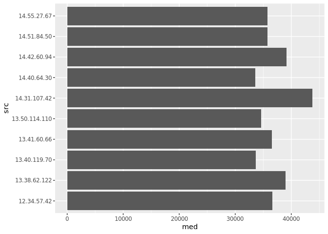

# Лабораторная работа №8. Анализ данных сетевого трафика с использованием аналитической in-memory СУБД DuckDB

## Выполнил Зайцев Илья Владимирович, mragentseven@yandex.ru

## Цель работы

1.  Изучить возможности СУБД DuckDB для обработки и анализ больших
    данных
2.  Получить навыки применения DuckDB совместно с языком
    программирования R
3.  Получить навыки анализа метаинфомации о сетевом трафике
4.  Получить навыки применения облачных технологий хранения, подготовки
    и анализа данных: Yandex Object Storage, Rstudio Server.

## Исходные данные

1.  ОС Windows 11 Pro
2.  Rstudio Server
3.  Библиотеки DuckDB, dplyr, ggplot2

## Ход работы

Скачиваем файл с данными

``` r
#download.file("https://storage.yandexcloud.net/arrow-datasets/tm_data.pqt", destfile = "tm_data.pqt")
```

Подключаем БД и загружаем данные в таблицу

``` r
library(duckdb)
```

    Loading required package: DBI

``` r
library(dplyr)
```


    Attaching package: 'dplyr'

    The following objects are masked from 'package:stats':

        filter, lag

    The following objects are masked from 'package:base':

        intersect, setdiff, setequal, union

``` r
con <- dbConnect(duckdb())
dbExecute(con, "CREATE TABLE zaytsevtbl AS SELECT * FROM read_parquet('tm_data.pqt')")
```

    [1] 105747730

Задание 1. Найди утечку данных из Вашей сети

Важнейшие документы с результатами нашей исследовательской деятельности
в области создания вакцин скачиваются в виде больших заархивированных
дампов. Один из хостов в нашей сети используется для пересылки этой
информации – он пересылает гораздо больше информации на внешние ресурсы
в Интернете, чем остальные компьютеры нашей сети. Определите его
IP-адрес.

``` r
dbGetQuery(con,"SELECT src FROM zaytsevtbl
WHERE (src LIKE '12.%' OR src LIKE '13.%' OR src LIKE '14.%') AND NOT (dst LIKE '12.%' AND dst LIKE '13.%' AND dst LIKE '14.%') GROUP BY src ORDER by sum(bytes) DESC LIMIT 1")
```

               src
    1 13.37.84.125

Задание 2. Найдите утечку данных 2

Другой атакующий установил автоматическую задачу в системном
планировщике cron для экспорта содержимого внутренней wiki системы. Эта
система генерирует большое количество трафика в нерабочие часы, больше
чем остальные хосты. Определите IP этой системы. Известно, что ее IP
адрес отличается от нарушителя из предыдущей задачи.

``` r
dbGetQuery(con,"SELECT time, COUNT(*) AS traffictime
FROM (SELECT timestamp, src, dst, bytes, ((src LIKE '12.%' OR src LIKE '13.%' OR src LIKE '14.%') AND (dst NOT LIKE '12.%' AND dst NOT LIKE '13.%' AND dst NOT LIKE '14.%')) AS traffic, EXTRACT(HOUR FROM epoch_ms(CAST(timestamp AS BIGINT))) AS time FROM zaytsevtbl) sub WHERE traffic = TRUE AND time BETWEEN 0 AND 24 GROUP BY time ORDER BY traffictime DESC;") %>% knitr::kable()
```

<table>
<thead>
<tr class="header">
<th style="text-align: right;">time</th>
<th style="text-align: right;">traffictime</th>
</tr>
</thead>
<tbody>
<tr class="odd">
<td style="text-align: right;">16</td>
<td style="text-align: right;">4490576</td>
</tr>
<tr class="even">
<td style="text-align: right;">22</td>
<td style="text-align: right;">4489703</td>
</tr>
<tr class="odd">
<td style="text-align: right;">18</td>
<td style="text-align: right;">4489386</td>
</tr>
<tr class="even">
<td style="text-align: right;">23</td>
<td style="text-align: right;">4488093</td>
</tr>
<tr class="odd">
<td style="text-align: right;">19</td>
<td style="text-align: right;">4487345</td>
</tr>
<tr class="even">
<td style="text-align: right;">21</td>
<td style="text-align: right;">4487109</td>
</tr>
<tr class="odd">
<td style="text-align: right;">17</td>
<td style="text-align: right;">4483578</td>
</tr>
<tr class="even">
<td style="text-align: right;">20</td>
<td style="text-align: right;">4482712</td>
</tr>
<tr class="odd">
<td style="text-align: right;">13</td>
<td style="text-align: right;">169617</td>
</tr>
<tr class="even">
<td style="text-align: right;">7</td>
<td style="text-align: right;">169241</td>
</tr>
<tr class="odd">
<td style="text-align: right;">0</td>
<td style="text-align: right;">169068</td>
</tr>
<tr class="even">
<td style="text-align: right;">3</td>
<td style="text-align: right;">169050</td>
</tr>
<tr class="odd">
<td style="text-align: right;">14</td>
<td style="text-align: right;">169028</td>
</tr>
<tr class="even">
<td style="text-align: right;">6</td>
<td style="text-align: right;">169015</td>
</tr>
<tr class="odd">
<td style="text-align: right;">12</td>
<td style="text-align: right;">168892</td>
</tr>
<tr class="even">
<td style="text-align: right;">10</td>
<td style="text-align: right;">168750</td>
</tr>
<tr class="odd">
<td style="text-align: right;">2</td>
<td style="text-align: right;">168711</td>
</tr>
<tr class="even">
<td style="text-align: right;">11</td>
<td style="text-align: right;">168684</td>
</tr>
<tr class="odd">
<td style="text-align: right;">1</td>
<td style="text-align: right;">168539</td>
</tr>
<tr class="even">
<td style="text-align: right;">4</td>
<td style="text-align: right;">168422</td>
</tr>
<tr class="odd">
<td style="text-align: right;">15</td>
<td style="text-align: right;">168355</td>
</tr>
<tr class="even">
<td style="text-align: right;">5</td>
<td style="text-align: right;">168283</td>
</tr>
<tr class="odd">
<td style="text-align: right;">9</td>
<td style="text-align: right;">168283</td>
</tr>
<tr class="even">
<td style="text-align: right;">8</td>
<td style="text-align: right;">168205</td>
</tr>
</tbody>
</table>

Очевидно, что рабочие часы с 16 до 24

``` r
dbGetQuery(con,"
SELECT src FROM (SELECT src, SUM(bytes) AS total_bytes FROM (SELECT *, EXTRACT(HOUR FROM epoch_ms(CAST(timestamp AS BIGINT))) AS time FROM zaytsevtbl) sub WHERE src <> '13.37.84.125' AND (src LIKE '12.%' OR src LIKE '13.%' OR src LIKE '14.%') AND (dst NOT LIKE '12.%' AND dst NOT LIKE '13.%' AND dst NOT LIKE '14.%') AND time BETWEEN 1 AND 15 GROUP BY src) grp ORDER BY total_bytes DESC LIMIT 1;")
```

              src
    1 12.55.77.96

Задание 3. Найдите утечку данных 3

Еще один нарушитель собирает содержимое электронной почты и отправляет в
Интернет используя порт, который обычно используется для другого типа
трафика. Атакующий пересылает большое количество информации используя
этот порт, которое нехарактерно для других хостов, использующих этот
номер порта. Определите IP этой системы. Известно, что ее IP адрес
отличается от нарушителей из предыдущих задач.

``` r
dbExecute(con,"CREATE TEMPORARY TABLE leak3 AS SELECT src, bytes, port FROM zaytsevtbl WHERE src <> '13.37.84.125' AND src <> '12.55.77.96' AND (src LIKE '12.%' OR src LIKE '13.%' OR src LIKE '14.%') AND (dst NOT LIKE '12.%' AND dst NOT LIKE '13.%' AND dst NOT LIKE '14.%');")
```

    [1] 38498353

``` r
dbGetQuery(con,"SELECT port, AVG(bytes) AS avg_bytes, MAX(bytes) AS max_bytes, SUM(bytes) AS sum_bytes, MAX(bytes) - AVG(bytes) AS agr FROM leak3
GROUP BY port HAVING MAX(bytes) - AVG(bytes) != 0
ORDER BY agr DESC LIMIT 1;")
```

      port avg_bytes max_bytes   sum_bytes    agr
    1   37  35089.99    209402 32136394510 174312

``` r
library(ggplot2)
library(lubridate)
```


    Attaching package: 'lubridate'

    The following objects are masked from 'package:base':

        date, intersect, setdiff, union

``` r
df <- dbGetQuery(con, "SELECT * FROM read_parquet('tm_data.pqt') WHERE (src LIKE '12.%' OR src LIKE '13.%' OR src LIKE '14.%') AND (dst NOT LIKE '12.%' AND dst NOT LIKE '13.%' AND dst NOT LIKE '14.%') AND (src NOT LIKE '13.37.84.125' AND src NOT LIKE '12.55.77.96');")

dfport <- df %>% select(src, port, bytes)
p = 37
dfportN <- dfport %>% filter(port == p) %>% group_by(src) %>% summarise(traffic = sum(bytes), count = n(), avg = traffic/count, med = median(bytes)) %>% arrange(desc(avg))
ggplot(head(dfportN, 10), aes(med, src)) + geom_col()
```



``` r
dbGetQuery(con,"SELECT src FROM (SELECT src, AVG(bytes) AS avg_bytes FROM leak3 WHERE port = 37 GROUP BY src) AS leak32 ORDER BY avg_bytes DESC
LIMIT 1;")
```

               src
    1 14.31.107.42

## Оценка результата

Все задания выполнены, требуемый результат достигнут

## Вывод

Был получен опыт работы с DuckDB и и закреплен навык применения Rstudio
Server в рамках анализа данных сетевой активности
